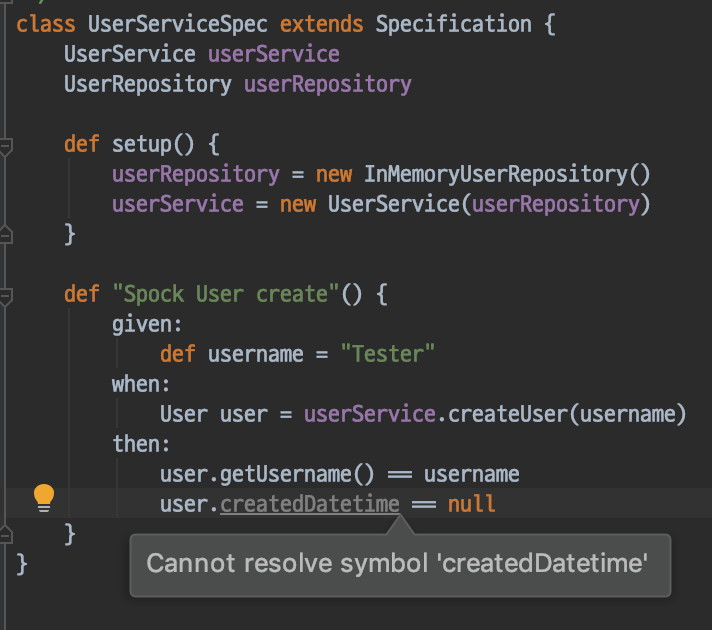
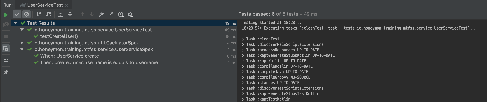

= 개발 주력언어 늘리기: 코틀린(Kotlin)
김지헌, jiheon.kim@woowahan.com
v0.0.1, 2019-03-04
:ij: 인텔리제이

[WARNING]
====
2019-03-04까지 쓰기!
====

== 코틀린을 주력언어로 삼게된 동기
[IMPORTANT]
====
애플리케이션과 관련된 모든 것을 **코틀린(Kotlin)** 으로 작성하고 싶었다. 
====

link:https://blog.jetbrains.com/kr/2018/10/jetbrains-day-%EC%84%9C%EC%9A%B8-2018/['JetBrains Day 서울 2018']에 참석하여 link:https://blog.jetbrains.com/kotlin/2018/10/kotlin-1-3/[Kotlin 1.3 Release] 관련 소식을 들으면서 '코틀린 써볼만 하겠다' 라는 생각했다(비동기 프로그래밍을 할 수 있는 코루틴즈(Coroutines)는 아직 관심대상이 아니다). 

안드로이드 앱개발자들에게는 이미 코틀린이 익숙하다. 행사장에도 서버사이드 개발자보다는 클라이언트사이드(안드로이드) 개발자가 많아보였다. 안드로이드 진영에서는 꽤 오래 전에 자바 대안언어로 link:https://developer.android.com/kotlin/?hl=ko[코틀린이 선택]되어 널리 사용되고 있다. 반면 서버사이드 측에서는 자바에 대한 제약이 크게 없기 때문에 Java 8을 기본 도입하고 스트림(Stream API) 남발(... 과거의 내 코드에 대한 묵념) 등이 가능했기 때문에 지금도 서버사이드에서는 코틀린에 대한 인기는 시들한 편이다. 자바가 6개월에 한번씩 정식버전을 출시하면서 지속적으로 개선되고 있기 때문에 굳이 자바를 쓰지 않아도 될 것 같다 느끼고 있다. 성숙한 언어이기에 언어적인 지원 외적으로 도구의 지원도 풍부하기 때문에 새로운 언어에 대한 갈망을 해소해주고 있다.

내가 '이제 코틀린을 본격적으로 살펴봐야겠다' 하고 결심하게 된 것은 link:https://docs.gradle.org/5.0/release-notes.html#kotlin-dsl-1.0['그레이들 5.0 출시와 함께 코틀린 DSL(1.0)를 지원한다']는 소식을 접하면서 부터다. 나는 스프링 부트를 사용하면서부터 link:https://docs.gradle.org/current/dsl/index.html[그레이들 그루비 DSL]를 사용해왔다. XML 보다 읽기 편하고 자유로운 문법이 마음에 들었다. 그렇지만 뭔가 아쉬움이 있었다. 내가 작성하는 빌드스크립트와 다른 사람이 작성하는 빌드스크립트가 제각각이었다. 그루비 언어가 가지는 특성도 한몫했다고 생각한다.

그루비의 자유로운 작성문법이 사람에 따라서 같은 기능이나 정의가 미묘하게 다르게 작성된다. 간단한 예를 들어보면

.`build.gradle`
[source,groovy]
----
def spockVersion = '1.2-groovy-2.5'

dependencies {
  testImplementation 'org.codehaus.groovy:groovy' 
  testImplementation "org.codehaus.groovy:groovy-test"
  testImplementation "org.spockframework:spock-core:$spockVersion"
  testImplementation("org.spockframework:spock-spring:$spockVersion")
}
----

위에 작성된 라이브러리 의존성 부분을 보면 link:http://groovy-lang.org/syntax.html#_single_quoted_string[작은따옴표(`'`, Single quoted string)] 와 link:http://groovy-lang.org/syntax.html#_double_quoted_string[큰따옴표(`"`, Double quoted string)]가 혼재되어 있으며 괄호를 쓴 것도 있고 그렇지 않은 경우도 있다(필요한 의존성을 찾아서 복붙하다보면 이렇게 된다). 그루비에서는 작은따옴표로 감싼 문자열은 삽입(interpolation)처리를 할 수 없다. 삽입(interpolation)처리하려면 큰따옴표로 감싼 문자열로 작성해야 한다. 작성자 입장에서 그것을 구분지어 작성해야하는가 하는 의문이 드는 부분이다. 작성하는 사람마다 표현방법이 다양하다는 것도 조금 불편했다. 빌드스크립트를 비롯해서 운영중인 프로젝트 코드는 꾸준하게 변경된다. 빌드스크립트는 작성문법을 강제하여 코드의 일관성을 가질 수 있도록 유도하는 것이 중요하다고 생각했다. 

[IMPORTANT]
====
그런 의미에서 보면 코틀린이 그레이들 코틀린 DSL이 도입되면서 빌드스크립트 작성문법이 강제되어 빌드스크립트의 통일성을 가지게 된다(DSL 은 약간 강제성이 있어야 한다고 생각을 갖게 되었다).
====

.`build.gradle.kts`
[source,kotlin]
----
val spockVersion = "1.2-groovy-2.5"

dependencies {
  testImplementation("org.codehaus.groovy:groovy")
  testImplementation("org.codehaus.groovy:groovy-test")
  testImplementation("org.spockframework:spock-core:$spockVersion")  // 선언된 변수를 문자열 안에서 치환가능하다.
  testImplementation("org.spockframework:spock-spring:$spockVersion")
}
----

**그레이들 코틀린 DSL**은 모든 문자열을 큰따옴표로 작성하도록 한다. 문자열에서 위치변환자 사용이 자유롭다. 그레이들 코틀린 DSL을 통해서 얻을 수 있는 이득은 다음과 같다.

* 코드 자동완성
* 오류코드 강조
* 빠른 문서보기 가능
* 리팩터링

이런 이득은 정적 언어가 제공하는 것이라 고 생각한다. 이 이득을 온전히 보기 위해서 사용자는 {ij}를 사용해야 한다(안드로이드 개발자는 안드로이드 스튜디오).

.link:https://docs.gradle.org/5.0/userguide/kotlin_dsl.html#sec:ide_support[IDE별 그레이들 코틀린 DSL 지원]
|====
|IDE ^|프로젝트 불러오기 ^|문법 강조  ^|편집지원

|IntelliJ IDEA
^|✓
^|✓
^|✓

|Android Studio
^|✓
^|✓
^|✓

|Eclipse IDE
^|✓
^|✓
^|✖

|Visual Studio Code(LSP)
^|✓
^|✓
^|✖

|Visual Studio
^|✓
^|✖
^|✖
|====

[NOTE]
====
'프로젝트 불러오기' 는 그레이들 코틀린 DSL(`build.gradle.kts`) 파일이 있을 때 그레이들을 빌드가 실행되며 프로젝트 빌드 과정이 수행되는가를 이야기 한다.
====

코틀린을 지금 운영 중인 프로젝트에 바로 반영하기에는 부담이 있다. 내가 좋다고 해서 프로젝트에 바로 반영하면 내가 자리를 비웠을 경우 다른 팀원에게 부담을 줄 수 있기 때문이다(물론 내가 마음대로 해놓고 '그렇게 됐어요. 이제 같이 해봐요' 할 수도 있겠지만 그건 같이 일하는 사람에 대한 예의가 아니다). 

[NOTE]
====
프로젝트에 새로운 것을 도입하기 위해서는 새로운 것을 충분히 학습하고 그 장단점을 파악하고 팀원들과 공유하여 동의를 얻는 과정이 필요하다. '자기가 하고 싶다'고 해서 막무가내로 도입(윽...)해놓고 나몰라라 하는 자세는 개발자로서 현명한 자세는 아니다.
====

지금 프로젝트에서는 그루비를 지원하는 스폭(Spock) 이라고 하는 테스트 프레임워크를 통합테스트 목적으로 사용한다. 작성했던 테스트 코드가 테스트 대상이 되는 코드의 변경을 제대로 감지하지 못하는 상황을 경험하면서 스폭 대신 스펙으로 바꿔보자는 생각을 하게된다(필드명이 변경되거나 사라지는 경우 그루비는 오류를 보여주지는 않는다. 테스트가 실행되어야 그제서야 테스트 대상 코드에 접근하다가 오류발생한다). 

코드화면에서는 위 그림과 같이 "Cannot resolve symbol 'createdDatetime'" 라는 메시지를 보여준다. IDE에서는 오류로 잡지 않기 때문에 코드를 열어보지 않으면 바로 인지할 수 없다(내가 게으른 것일지도...). '코틀린과 스펙을 이용하면 이런 일은 일어나지 않을거야' 라고 자기최면을 걸고 있었다.

[NOTE]
====
핑계없는 무덤은 없다지....

자바 개발 및 테스트 환경으로 가도 되는데 꼭 코틀린을 써보겠다고 스펙을 걸고 넘어졌다.
====

== 테스트(Test)
**개발자**라면 **누구나(?!) 자신이 작성한 코드가 정상적으로 동작하는지 확인하고 싶어한다**(라고 생각한다).

작성한 코드가 정상적으로 동작하는지 확인하는 간단한 방법 중 하나는 **처리결과를 출력**하여 **자신이 예상한 결과와 동일한지 눈으로 확인하는 것**이다. 테스트가 정상적으로 동작하는지 매번 눈으로 확인해야 한다는 것은 너무 번거롭다(그러면서 가끔 내가 의도한 에러로그가 출력되는지 눈으로 확인하는 코드를 작성하기도 한다).

[source,java]
----
public class TestApplication {
  public static void main(String[] args) {
    int a = 1;
    int b = 2;
    int c = a + b;
    System.out.println(c == 3); // <1>
  }
}
----
<1> (1 + 2) == 3 의 결과를 출력하는 간단한 확인코드다. true 가 출력되면(?) 내 의도를 충족한다.

결과를 화면출력하여 눈으로 확인하는 것보다 조금 더 명확한 피드백을 받을 수 있으면 테스트가 조금 더 신명날 것이다. 자신이 코드가 정상적으로 동작할 때 [green]#성공(Success)# 과 [red]#실패(Failure)# 로 즉각적인 피드백(Feedback)해줬으면 좋겠다는 바람이 모여 테스트 프레임워크가 나왔다. 테스트 프레임워크는 개발자가 예상한 결과와 처리 결과가 일치하는지를 가시적으로 보여준다.

== JUnit Vs. Spock Vs. Spek
자바 프로그래밍 언어에서 사용가능한 테스트 프레임워크는 크게 JUnit, Spock과 Spek 을 뽑을 수 있다(보다 많이 있지만 생략한다). 각 특징에 따라 구분지어보면 다음과 같다.

.테스트 프레임워크 비교
[cols="2, 3, 3, 3"]
|====
|특징  |link:https://junit.org/junit5/[JUnit4/5] |link:http://spockframework.org/[Spock] |link:https://spekframework.org/[Spek]

|설명
|JUnit은 **자바** 기반 테스트 프레임워크다.
|Spock은 **그루비** 기반 테스트 프레임워크다.
|Spek은 **코틀린** 기반 테스트 프레임워크다.

|개발언어
|link:https://www.java.com[자바(Java)](정적언어)
|link:http://groovy-lang.org/[그루비(Groovy)](동적언어)
|link:https://kotlinlang.org/[코틀린(Kotlin)](정적언어)

|장점
a|
* 자바 개발자들에게 친숙한 단위테스트 프레임워크다.
* 애너테이션 기반으로 테스트 케이스를 명확하게 선언하고 작성가능하다.
a|
* BDD에 기반한 테스트 작성이 가능하다(link:http://spockframework.org/spock/docs/1.2/spock_primer.html[Spock Primer]).
* 동적언어의 장점을 활용하여 실행 시 동적처리가 가능하다.
a|
* BDD에 기반한 테스트 작성이 가능하다(link:https://spekframework.org/gherkin/[Gherkin]).
* 자바 프로그래밍 언어에 익숙한 개발자가 큰 거부감없이 이주가능하다.

|단점
a|
* 단위 테스트 이상의 테스트에서는 불편할 수 있다.
* 테스트 기능추가를 위해 여러가지 의존성 라이브러리가 필요하다.
a|
* 그루비(Groovy)를 익혀야 한다.
* 그루비 및 Spock 관련 설정 및 의존성 라이브러리를 추가해야한다.
* 동적언어의 특징으로 자바코드가 변경되어도 컴파일 단계에서 코드에러가 발생하지 않아 작성 후 테스트 대상 코드가 변경되어도 테스트를 실행하기 전까지 테스트의 오동작여부를 확인할 수 없다(이 부분은 테스트를 먼저 손보면 되지 않느냐 하는 의견이 있을 수 있다).
a|
* 코틀린(Kotlin)을 익혀야 한다.
* 코틀린 및 Spek 관련 설정 및 의존성 라이브러리를 추가해야한다.
* IDE에서 테스트를 실행하기 위해서는 플러그인을 설치해야 한다.
* 과도한 Spek을 요구한다(쓰다가 짜증...).
|====

=== JUnit 테스트 코드
JUnit4 는 많은 분들에게 익숙할 것이다.
.`JUnit4`
[source,java]
----
public class BasicTest {
  private UserRepository userRepository;
  private UserService userService;

  @Before
  public void setUp() {
    userRepository = new InMemoryUserRepository();
    userService = new UserService(userRepository);
  }

  @Test
  public void testCreateUser() {
    //given
    String username = "Tester"
    //when
    User user = userService.create(username)
    //then
    assertEquals(user.username, username)
  }
}
----

JUnit5 는 모듈화를 걸치면서 하나의 거대했던 모듈이 크게 JUnit4 레거시를 지원하는 모듈과 새롭게 정리된 JUnit5 모듈로 나뉘었다. 그래서 JUnit5 관련해서 필요한 의존성 라이브러리도 많아졌다. 스프링 부트 2.1.X 까지는 JUnit4를 지원하기 때문에 JUnit5를 사용하기 위해서는 별도로 의존성 라이브러리를 선언하고 관리해야 한다(BOM 방식을 통해 JUnit5 버전관리하고 있어서 버전은 신경쓰지 않아도 된다).

.`JUnit5`
[source,java]
----
@TestInstance(TestInstance.Lifecycle.PER_CLASS)
public class UserServiceTest {
    private UserRepository userRepository;
    private UserService userService;

    @BeforeAll
    public void setUp() {
        userRepository = new InMemoryUserRepository();
        userService = new UserService(userRepository);
    }

    @Test
    public void testCreateUser() {
        //given
        String username = "Tester";
        //when
        User user = userService.createUser(username);
        //then
        assertThat(user.getUsername()).isEqualTo(username);
    }
}
----

[source,java]
----
@Test
public void test {
  // given
  // when
  // then
}
----

=== Spock 테스트 코드

[source,groovy]
----
class UserServiceSpec extends Specification {
    UserService userService
    UserRepository userRepository

    def setup() {
        userRepository = new InMemoryUserRepository()
        userService = new UserService(userRepository)
    }

    def "Spock User create"() {
        given:
            def username = "Tester"
        when:
            User user = userService.createUser(username)
        then:
            user.getUsername() == username
    }
}
----

=== Spek 테스트 코드
두근거리는 마음으로 SPEK 명세서를 보면서 테스트코드를 조금씩 작성해봤다. 그런데,

[source,kotlin]
----
object CacluatorSpec : Spek({
    val calculator = Calculator()

    Feature("Calculator add") {
        Scenario("Kotlin Calculator: add") {
            var result = 0
            val left = 1
            val right = 2

            When("1 + 2") {
                result = calculator.add(left, right)
            }

            Then("result is 3") {
                assertEquals(result, 3)
            }
        }
    }
})
----

Spek 으로 테스트코드를 작성하다가 감정이 격해졌다(쓰기 불편해!!! 크아아악!!! 안해!!).

Spek 작성 스타일 중 link:https://spekframework.org/gherkin/[Gherkin]이 BDD식으로 (Given-When-Then) 식으로 작성할 수 있어보여서 따라 작성하다가 너무 불편했다. 각 단계별로 설명(description)을 반드시 적어야 했다. 

[NOTE]
====
{ij}에서 Spek 테스트를 개별적으로 실행하기 위해서는 link:https://plugins.jetbrains.com/plugin/10915-spek-framework[Spek Framework] 플러그인을 설치해야 한다.

해당 플러그인을 설치하지 않은 경우는 빌드 테스트를 통해서 실행가능하다.
====

== 정리
[NOTE]
====
코틀린을 쓰고 싶었습니다(뜨헙... 본심이 나와버렸다).
====

Spek 을 사용하면서 코틀린 사용을 권해보려고 했는데, Spek 테스트 코드를 작성하는 과정이 너무 번거로웠다. 크흐... 그래서 내린 중재안은 자바로 작성하던 테스트 코드를 코틀린으로 작성하는 것이다. 코틀린은 자바호환성이 뛰어나며, {ij}에서는 자바코드를 복사해서 코틀린 파일에 붙여넣기 하면 자동으로 언어변경작업도 처리한다. 

블라브라블라

개인적인 타협점은 (Kotlin + JUnit5 + etc) 이었다. 

블라브라브라브라

익숙했던 자바 코드를 코트린으로 변경하면서 간결하게 작성할 수 있었다.

== 참고문헌
* link:https://en.wikipedia.org/wiki/Software_testing[Software testing - Wikipedia]
* link:http://groovy-lang.org/[그루비(Groovy)]
** link:http://spockframework.org/[Spock framework]
* link:https://kotlinlang.org/[코틀린(Kotlin)]
** link:https://spekframework.org/[Speck framework]
** link:https://blog.philipphauer.de/best-practices-unit-testing-kotlin/[Best Practices for Unit Testing in Kotlin]
** link:https://www.udacity.com/course/kotlin-bootcamp-for-programmers--ud9011[프로그래머를 위한 코틀린 부트캠프 - 구글제공]
** link:https://docs.gradle.org/5.0/userguide/kotlin_dsl.html#sec:ide_support[Gradle Kotlin DSL IDE support]